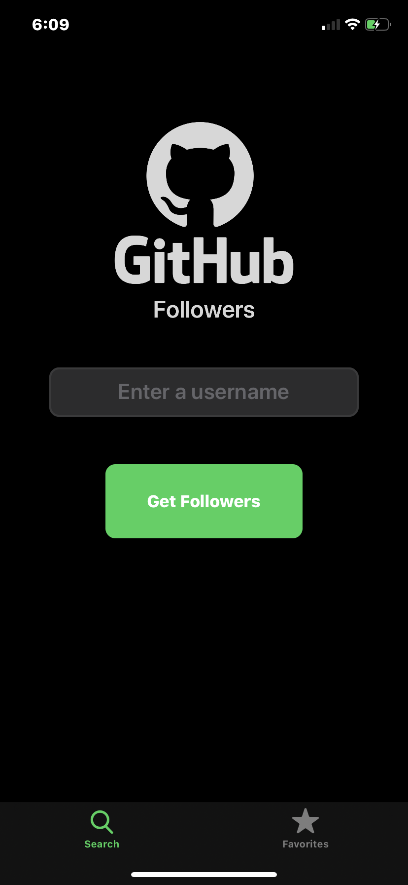
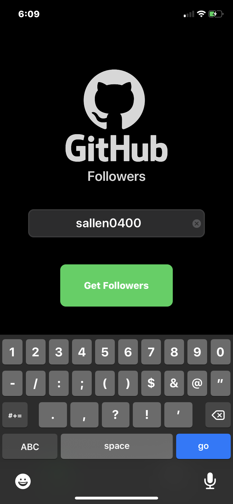
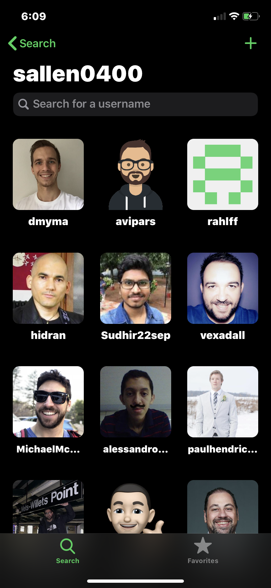
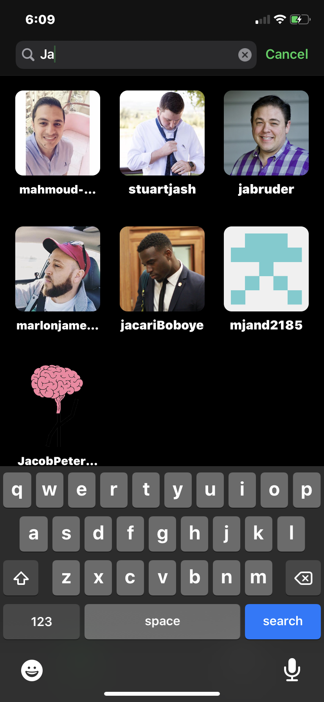
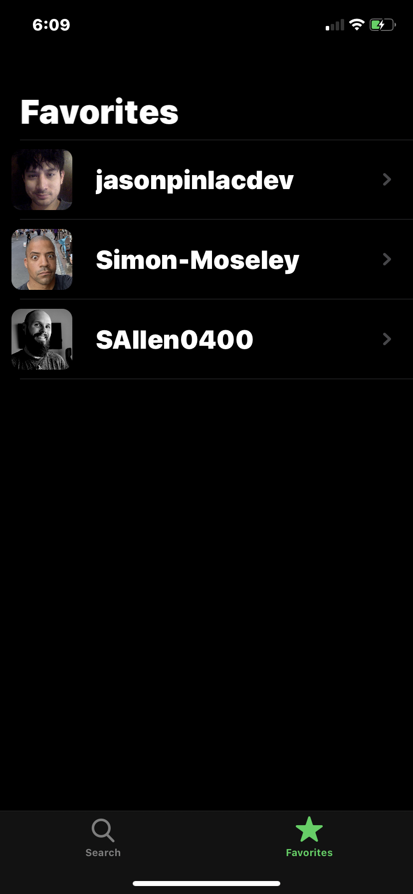
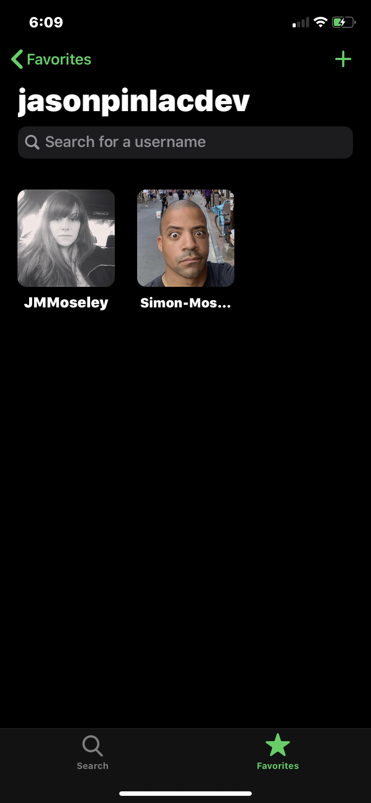
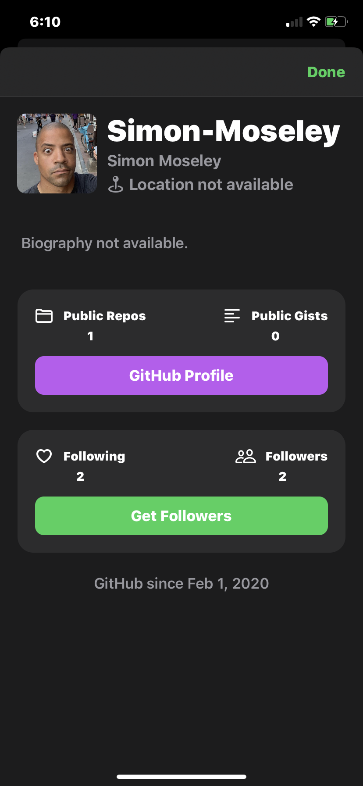
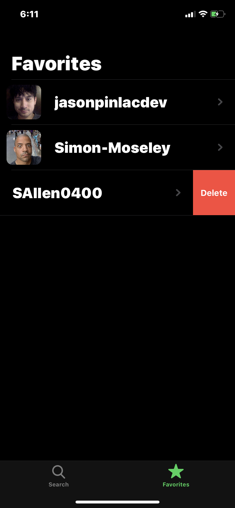
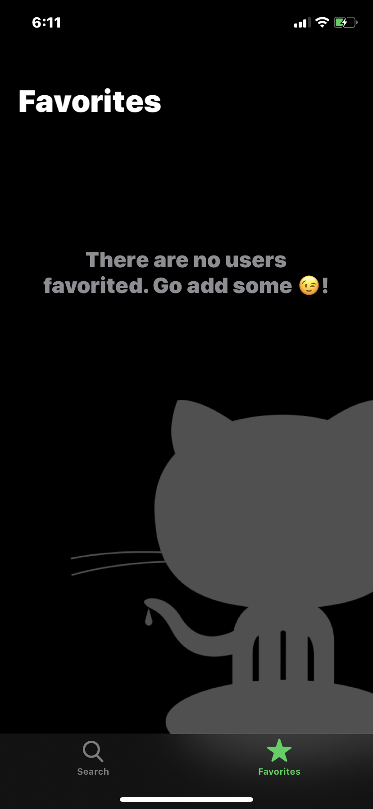
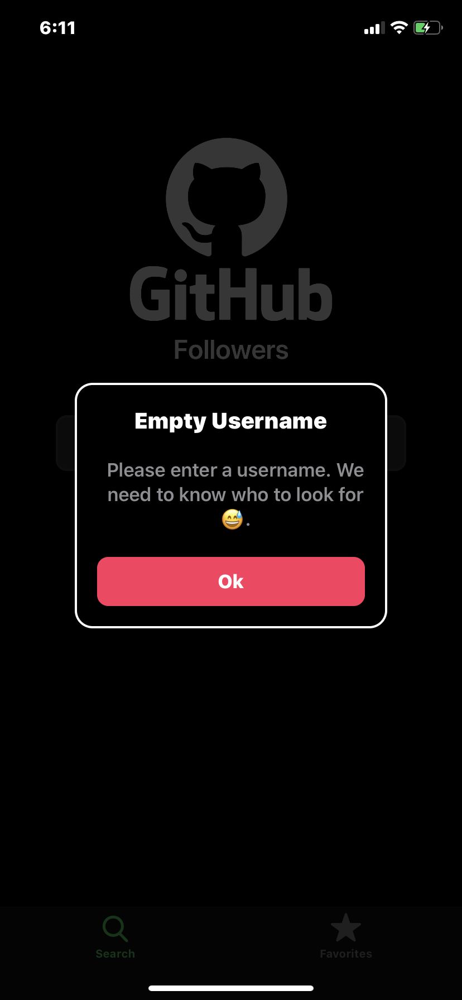

# iOS-Dev-Job-Interview-Practice
This repository contains a practice take home project for an iOS dev job interview.

## Overview of the project
This project involves making network calls to GitHub's API to access its users and followers data. Retrieving, handling, and parsing the JSON data. Displaying and formatting the data within the application's UI that is presentable and coherent in styling.

The UI is built 100% programmatically without the use of Storyboards. The reason for this is to build a deeper understanding and appreciation for UI/UX design implementation.

No 3rd party libraries are used for this project. Understanding the trade offs between using a 3rd party library or not is key. For the purpose of this project only GET URL requests are made and therefore using my own implemtation with Apple's URLSession class is satisfactory.

## Details of the project
* Proper project organization adhering as close as possible to the MVC architecture.
* Having the applications models conform to the Codable protocol for setting up JSON parsing.
* A NetworkManager class created to handle and manage all the funcationality for requests to the API endpoints.
* Proper memory management using capture lists, weak, etc. correctly.
* Image caching to reduce the number of network calls made.
* Pagination of network calls to retrieve sets of GitHub followers of a user as needed.
* Implementation of loading states during our network calls.
* Managing empty states following network calls.
* Handling errors following network calls via a custom reusable alert UIViewController.
* Implementing a UICollectionView using Apple's Diffable Datasource to efficiently setup and manage a dymanic UI/UX for a GitHub user's followers.
* Use of Apple's UISearchController for filtering the collection view on search.
* Implenting a UITableView with swipe to delete for managing the application's favorite GitHub users.
* Composition of child UIViews and child UIViewControllers structured keep the app's viewcontrollers as atomic, encapsulated, and self-managing as possible.
* Persistence management using UserDefaults.
* Dynamic Type.
* Date Formatting.
* Stack Views.
* SFSymbols.
* Delegate Protocol Design Pattern.
* SafariViewController.

## Application Images
         

## Acknowledgment 
Credit to Sean Allen for putting together a great course with so much to learn and practice.
